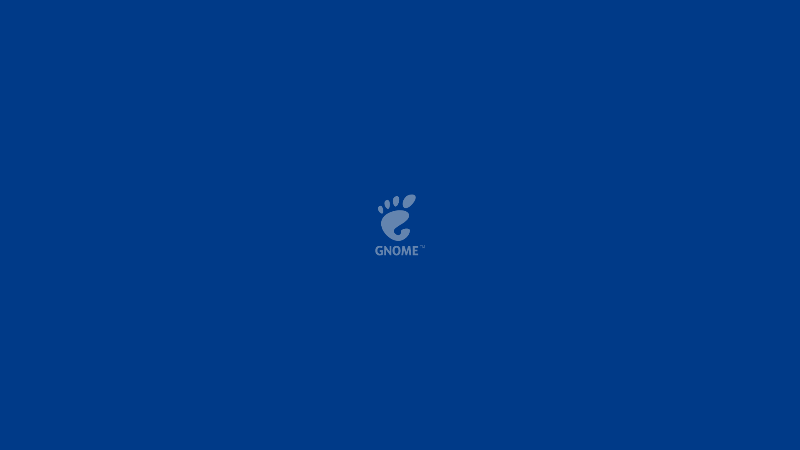

# Solid-GNOME

Solid-GNOME is a script that installs solid wallpapers on GNOME.

## Features

### Light-dark change

Solid-GNOME wallpapers support light-dark change:

Light mode:


Dark mode:


## How to install?

1. Extract compressed file and open your terminal application on extracted folder.
2. Run the follow command:
    ```bash
    chmod 777 ./install.sh
    ```
3. After that, run:
    ```bash
    sudo ./install.sh
    ```
4. When read, press ENTER.
5. And done! Just open Gnome Settings, click in Appearance and choose your wallpaper.

## How to uninstall?

1. Run on uncompressed folder:
    ```bash
    chmod 777 ./uninstall.sh
    ```
2. After that, run:
    ```bash
    sudo ./uninstall.sh
    ```
3. When read, press ENTER.
4. And done! Solid-GNOME is no longer installed. 

## Wallpapers

### Light mode


### Dark mode





## Screenshots


---

Built with love by [mateusm4](https://github.com/mateusm4).

No license